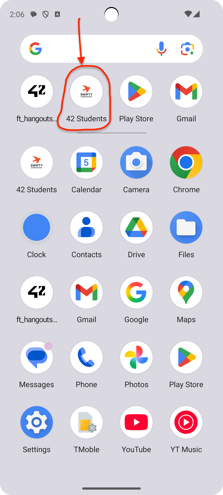
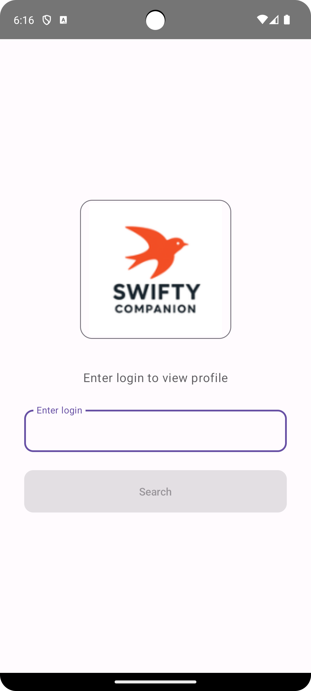
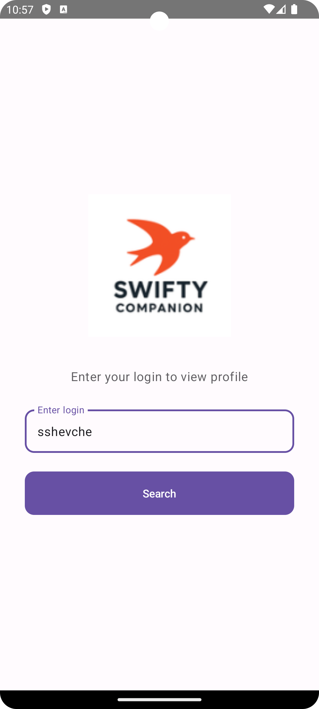
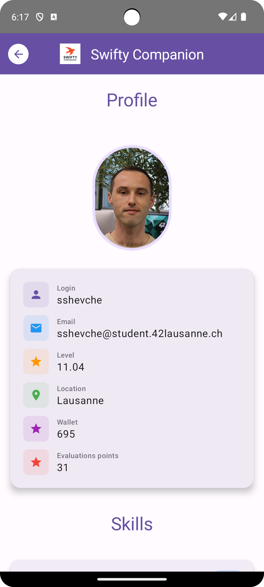
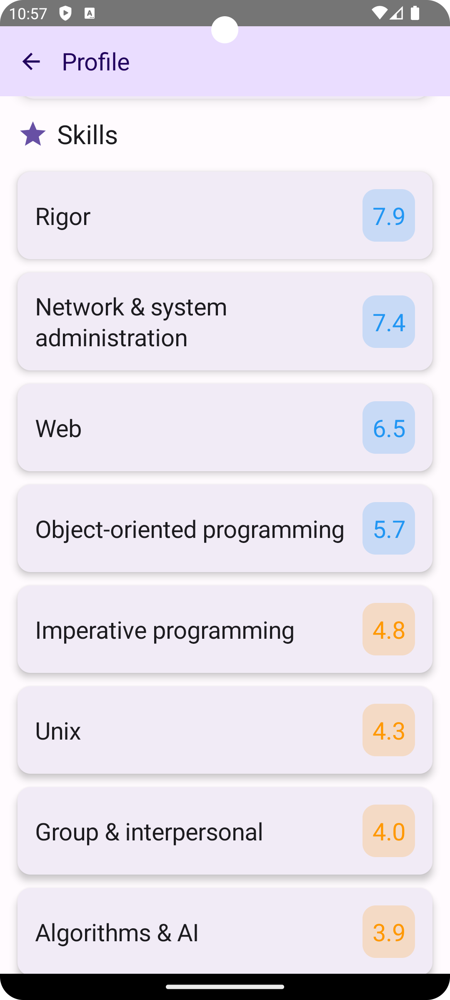
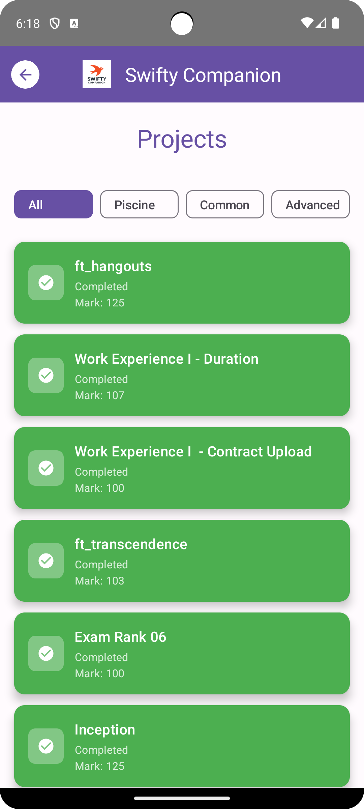
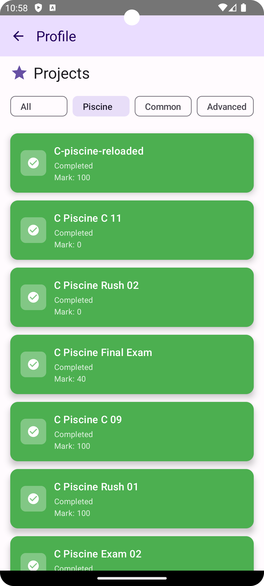
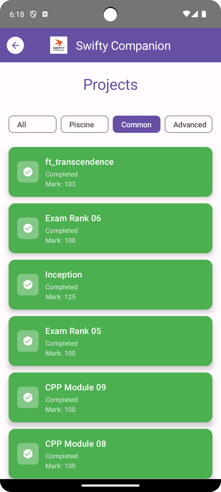
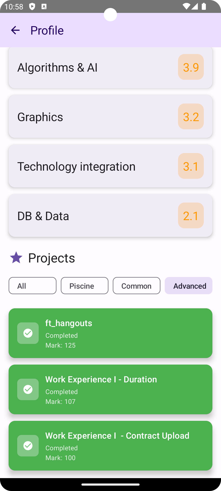

# Swifty Companion

A native Android application for retrieving and displaying information about 42 students through the 42 API using OAuth2 authentication.

## Features

- ✅ **OAuth2 Authentication** - Secure login via 42 Intra OAuth2 with automatic token refresh
- ✅ **User Profile** - Comprehensive user information display (login, email, mobile, level, location, wallet, evaluations points)
- ✅ **Skills Display** - View student skills with levels, sorted in descending order
- ✅ **Projects List** - View completed and failed projects with advanced filtering:
  - **All** - Show all projects
  - **Piscine** - Show only Piscine projects
  - **Common Core** - Show only Common Core projects
  - **Advanced Core** - Show Advanced Core projects (hangouts, work experience, etc.)
- ✅ **Error Handling** - Comprehensive error handling with retry mechanism
- ✅ **Responsive Design** - Adaptive layout for different screen sizes and orientations
- ✅ **Token Management** - Automatic token refresh on expiration with protection against infinite recursion
- ✅ **Material Design 3** - Modern UI following Material Design 3 guidelines
- ✅ **Navigation** - Back navigation support to return to login screen
- ✅ **Request Timeout** - 30-second timeout handling to prevent infinite loading

## Application Preview

<div align="center">

### Start Screen

</div>

<div align="center">
  
</div>

<div align="center">

Initial screen with application logo.

</div>

<div align="center">

### Start Page - Empty Login Field

</div>

<div align="center">
  
</div>

<div align="center">

Login screen with empty search field ready for user input.

</div>

<div align="center">

### Start Page - Filled Login Field

</div>

<div align="center">
  
</div>

<div align="center">

Login screen with filled search field showing entered student login.

</div>

<div align="center">

### Profile - User Information

</div>

<div align="center">
  
</div>

<div align="center">

User profile card showing profile picture, login, email, level, location, wallet, and evaluations points.

</div>

<div align="center">

### Profile - Skills List

</div>

<div align="center">
  
</div>

<div align="center">

List of user skills sorted by level in descending order, with color-coded level indicators and percentage values.

</div>

<div align="center">

### Profile - Projects with All Filters

</div>

<div align="center">
  
</div>

<div align="center">

Projects list with all filter chips visible (All, Piscine, Common, Advanced) showing all completed and failed projects.

</div>

<div align="center">

### Profile - Projects Filter (Piscine)

</div>

<div align="center">
  
</div>

<div align="center">

Filtered view displaying only Piscine projects with their completion status and marks.

</div>

<div align="center">

### Profile - Projects Filter (Common Core)

</div>

<div align="center">
  
</div>

<div align="center">

Filtered view displaying only Common Core projects from the 42 cursus.

</div>

<div align="center">

### Profile - Projects Filter (Advanced Core)

</div>

<div align="center">
  
</div>

<div align="center">

Filtered view displaying only Advanced Core projects, including hangouts and work experience.

</div>

## Technology Stack

- **Language**: Kotlin
- **Platform**: Native Android
- **UI Framework**: Jetpack Compose
- **Architecture**: MVVM (Model-View-ViewModel)
- **HTTP Client**: Retrofit 2.9.0 + OkHttp 4.12.0
- **Dependency Injection**: Hilt 2.51.1
- **Data Storage**: DataStore Preferences 1.0.0
- **Navigation**: Navigation Compose 2.7.5
- **Image Loading**: Coil 2.5.0
- **JSON Parsing**: Gson 2.10.1
- **Minimum SDK**: 24 (Android 7.0 Nougat)
- **Target SDK**: 34 (Android 14)
- **Compile SDK**: 34
- **Java Version**: 17

## Project Setup

### 1. Prerequisites

- Android Studio Hedgehog (2023.1.1) or newer
- JDK 17
- Android SDK 24+ (Android 7.0)
- Target SDK 34 (Android 14)

### 2. Clone and Open Project

1. Clone the repository
2. Open the project in Android Studio
3. Wait for Gradle synchronization to complete

### 3. Configure OAuth2 Credentials

Create a `local.properties` file in the project root directory:

```properties
API_UID=your_client_id_here
API_SECRET=your_client_secret_here
API_REDIRECT_URI=students42://oauth/callback
```

**Important**: Get these credentials by registering an OAuth2 application on [42 Intra](https://profile.intra.42.fr/oauth/applications)

### 4. Configure OAuth2 Application on 42 Intra

1. Go to https://profile.intra.42.fr/oauth/applications
2. Click "New application"
3. Set the following:
   - **Name**: Your application name
   - **Redirect URI**: `students42://oauth/callback`
   - **Scopes**: Select required permissions
4. Copy the **UID** (Client ID) and **SECRET** (Client Secret)
5. Paste them into `local.properties` as `API_UID` and `API_SECRET`

### 5. Build and Run

1. Sync the project (File → Sync Project with Gradle Files)
2. Connect an Android device or start an emulator (API 24+)
3. Press Run (Shift+F10) or click the Run button

## Project Structure

```
app/src/main/java/com/students42/app/
├── auth/
│   ├── AuthService.kt              # OAuth2 authentication service
│   └── OAuthCallbackActivity.kt    # OAuth callback handler activity
├── data/
│   ├── models/                     # Data models for API responses
│   │   ├── UserModel.kt            # Main user data model with computed properties
│   │   ├── SkillModel.kt           # Skill data model
│   │   ├── ProjectModel.kt         # Project data model with filtering logic
│   │   ├── ProjectInfoModel.kt     # Project information model
│   │   ├── CursusUserModel.kt      # Cursus user data model
│   │   ├── CampusUserModel.kt      # Campus user data model
│   │   ├── LocationModel.kt        # Location data model
│   │   └── TokenResponse.kt        # OAuth token response model
│   ├── api/
│   │   ├── ApiService.kt           # Retrofit API interface
│   │   └── AuthInterceptor.kt      # Token injection & auto-refresh interceptor
│   ├── local/
│   │   └── TokenRepository.kt      # DataStore token management
│   └── repositories/
│       └── UserRepository.kt       # User data repository with Flow-based API
├── ui/
│   ├── login/
│   │   ├── LoginScreen.kt          # Login screen composable
│   │   ├── LoginViewModel.kt       # Login screen view model
│   │   └── LoginState.kt           # Login state sealed class
│   ├── profile/
│   │   ├── ProfileScreen.kt        # Profile screen composable
│   │   ├── ProfileViewModel.kt     # Profile screen view model
│   │   └── ProfileState.kt         # Profile state sealed class
│   └── components/
│       ├── UserInfoCard.kt         # User information card component
│       ├── SkillsList.kt           # Skills list component
│       └── ProjectsList.kt         # Projects list component with filters
├── navigation/
│   └── NavGraph.kt                 # Navigation graph configuration
├── di/
│   ├── AppModule.kt                # Application-level dependency injection
│   ├── AuthModule.kt               # Authentication module
│   ├── NetworkModule.kt            # Network configuration (Retrofit, OkHttp)
│   └── Qualifiers.kt               # Hilt qualifiers for injection
├── utils/
│   ├── Constants.kt                # Application constants
│   ├── ErrorHandler.kt             # Centralized error handling
│   ├── Result.kt                   # Sealed class for API results
│   └── TokenTestHelper.kt          # Token testing utility for development
├── MainActivity.kt                 # Main activity with deep link handling
└── Students42Application.kt        # Application class with Hilt setup
```

## Screens

### Login Screen

**Features:**
- OAuth2 authentication flow with browser redirect
- Application logo display (ic_launcher)
- User search by login (42 username)
- Error handling with retry mechanism
- Request timeout handling (30 seconds)
- Adaptive layout for different screen sizes
- Support for landscape and portrait orientations

**User Flow:**
1. User enters their 42 login
2. If not authenticated, user is redirected to 42 Intra for OAuth
3. After authentication, user can search for any student by login
4. On successful search, navigates to profile screen

### Profile Screen

**Features:**
- **User Information Card:**
  - Login (username)
  - Email
  - Level (highest level from all cursus)
  - Location (campus or location)
  - Wallet (correction points)
  - Evaluations points (correction points)
  - Profile picture (circular image)

- **Skills List:**
  - Displays all user skills
  - Skills sorted by level in descending order
  - Level displayed in color-coded boxes:
    - Green: Level ≥ 10
    - Blue: Level ≥ 5
    - Orange: Level ≥ 2
    - Gray: Level < 2

- **Projects List:**
  - Filter chips for project types:
    - **All**: Shows all completed and failed projects
    - **Piscine**: Shows only Piscine projects
    - **Common**: Shows only Common Core projects
    - **Advanced**: Shows Advanced Core projects
  - Visual distinction:
    - Green cards with checkmark: Completed projects
    - Red cards with X: Failed projects
    - Gray cards: Other status projects
  - Displays project name, status, and final mark

- **Error Handling:**
  - Retry dialog on errors
  - Network error handling
  - Timeout handling

- **Navigation:**
  - Back button returns to login screen
  - Clears navigation stack on back

## Architecture

The app follows **MVVM (Model-View-ViewModel)** architecture pattern:

### Components

- **Model**: Data models (`UserModel`, `SkillModel`, `ProjectModel`, etc.)
- **View**: Jetpack Compose UI screens (`LoginScreen`, `ProfileScreen`)
- **ViewModel**: State management and business logic (`LoginViewModel`, `ProfileViewModel`)
- **Repository**: Data layer abstraction (`UserRepository`)
- **Data Source**: API service (`ApiService`) and local storage (`TokenRepository`)

### Data Flow

1. **User Interaction**: User interacts with UI (Compose Screen)
2. **ViewModel**: ViewModel handles user actions and manages state
3. **Repository**: Repository fetches data from API or local storage
4. **API Request**: API requests go through `AuthInterceptor`:
   - Checks token expiration
   - Automatically refreshes token if expired
   - OAuth token endpoint requests bypass token check (prevents infinite recursion)
   - Injects Authorization header
5. **Response**: Response flows back through Repository → ViewModel → UI
6. **UI Update**: UI updates reactively via `StateFlow`

### State Management

- **StateFlow**: Used for reactive state management in ViewModels
- **Sealed Classes**: `LoginState` and `ProfileState` for type-safe state representation
- **Result Wrapper**: `Result` sealed class for API responses (Loading, Success, Error)

## Key Features Implementation

### OAuth2 Authentication

- **Flow**: Authorization code flow with PKCE
- **Token Storage**: Secure storage in DataStore Preferences
- **Token Refresh**: Automatic refresh on expiration
- **Deep Links**: Custom URL scheme `students42://oauth/callback`

### Token Management

**Automatic Token Refresh:**
- Token expiration is checked before each API request
- If expired, token is automatically refreshed using refresh token
- New token is stored and used for the request
- Thread-safe implementation using `ReentrantLock`

**Protection Against Infinite Recursion:**
- OAuth token endpoint (`/oauth/token`) requests bypass token validation
- Prevents infinite loop when refreshing token

**Request Timeout:**
- 30-second timeout for API requests
- Prevents infinite loading states
- Shows user-friendly error message on timeout

### Error Handling

**Centralized Error Handling:**
- `ErrorHandler` utility class for consistent error messages
- Handles various error types:
  - Network errors
  - HTTP errors (401, 404, 500, etc.)
  - Timeout errors
  - Unknown errors

**User Experience:**
- User-friendly error messages
- Retry mechanism for failed requests
- Snackbar notifications for errors
- Error dialogs with retry option

### Data Models

**UserModel:**
- Computed properties for derived data:
  - `level`: Highest level from all cursus
  - `locationName`: Primary location or campus name
  - `evaluations`: Mapped from `correctionPoint`
  - `imageUrl`: Extracted from nested image model

**ProjectModel:**
- Computed properties for project classification:
  - `isPiscine`: Checks if project is Piscine
  - `isCommonCore`: Checks if project is Common Core
  - `isAdvancedCore`: Checks if project is Advanced Core
  - `isCompleted`: Checks if project is completed
  - `isFailed`: Checks if project is failed

**Smart Filtering:**
- Projects are deduplicated by ID and normalized name
- Prevents duplicate project entries

### UI Components

**UserInfoCard:**
- Material Design 3 card
- Icons for each information field
- Responsive layout

**SkillsList:**
- Sorted by level (descending)
- Color-coded level indicators
- Material Design 3 styling

**ProjectsList:**
- Filter chips for project type filtering
- Color-coded project status
- Material Design 3 cards

## Testing Token Refresh

The app includes a `TokenTestHelper` utility for testing token refresh functionality during development.

### Method 1: Using TokenTestHelper (Recommended for Development)

```kotlin
import com.students42.app.utils.TokenTestHelper

// Set an expired token
TokenTestHelper.setExpiredToken(context)

// Set a token that expires in a few seconds
TokenTestHelper.setTokenExpiringSoon(context, secondsUntilExpiration = 5)

// Check if token is expired
val isExpired = TokenTestHelper.isTokenExpired(context)

// Clear all tokens
TokenTestHelper.clearAllTokens(context)
```

### Method 2: Via Logcat (Monitoring)

1. Enable HTTP request logging in `NetworkModule`
2. Execute any API request
3. Check logs:
   - If token is expired, you'll see a request to `/oauth/token` with `grant_type=refresh_token`
   - Then the original request will be retried with the new token

### Method 3: Real-time Testing

1. Log into the app
2. Wait for token expiration (usually 2 hours)
3. Execute any API request
4. Verify that:
   - Token was automatically refreshed
   - Request completed successfully
   - User was not logged out

## API Endpoints

The app uses the following 42 Intra API endpoints:

### Authentication Endpoints

---

#### `POST /oauth/token` - Get Access Token

Obtains an access token using the authorization code from OAuth flow.

**Parameters:**
- `grant_type`: `"authorization_code"`
- `client_id`: OAuth application client ID
- `client_secret`: OAuth application client secret
- `code`: Authorization code received from OAuth callback
- `redirect_uri`: OAuth redirect URI (`students42://oauth/callback`)

**Response:** `TokenResponse`
- `accessToken`: Access token for API requests
- `refreshToken`: Refresh token for token renewal
- `expiresIn`: Token expiration time in seconds (typically 7200)

**Usage:** Called during initial OAuth authentication flow.

---

#### `POST /oauth/token` - Refresh Access Token

Refreshes an expired access token using the refresh token.

**Parameters:**
- `grant_type`: `"refresh_token"`
- `client_id`: OAuth application client ID
- `client_secret`: OAuth application client secret
- `refresh_token`: Refresh token from previous authentication

**Response:** `TokenResponse`
- `accessToken`: New access token
- `refreshToken`: New refresh token (may be the same or new)
- `expiresIn`: Token expiration time in seconds

**Usage:** Automatically called by `AuthInterceptor` when access token expires.

---

### User Endpoints

---

#### `GET /v2/users/{login}` - Get User Information

Retrieves detailed information about a user by their login (username).

**Path Parameters:**
- `login`: 42 username (e.g., `"sshevche"`)

**Response:** `UserModel`
- `id`: User ID
- `login`: Username
- `email`: Email address
- `location`: Current location
- `wallet`: Correction points (wallet)
- `correctionPoint`: Evaluation points
- `image`: Profile image information
- `cursusUsers`: List of cursus enrollments (contains level)
- `campusUsers`: List of campus associations
- `campus`: List of campus information
- `skills`: List of skills (if included in response)
- `projectsUsers`: List of user projects (if included in response)

**Computed Properties:**
- `level`: Highest level from all cursus
- `locationName`: Primary location or campus name
- `evaluations`: Mapped from `correctionPoint`
- `imageUrl`: Extracted profile image URL

**Usage:** Called when user searches for a student by login on the login screen.

---

#### `GET /v2/users/{userId}/skills` - Get User Skills

Retrieves all skills for a specific user.

**Path Parameters:**
- `userId`: User ID (integer)

**Response:** `List<SkillModel>`
- Each skill contains:
  - `id`: Skill ID
  - `name`: Skill name
  - `level`: Skill level (decimal)

**Usage:** Called to fetch user skills separately if not included in user info response. Used as fallback if skills are not in the main user response.

---

#### `GET /v2/users/{userId}/projects_users` - Get User Projects

Retrieves all projects for a specific user.

**Path Parameters:**
- `userId`: User ID (integer)

**Response:** `List<ProjectModel>`
- Each project contains:
  - `id`: Project ID
  - `status`: Project status
  - `finalMark`: Final mark (if graded)
  - `validated`: Whether project is validated
  - `marked`: Whether project is marked
  - `project`: Project information (name, slug)
  - `cursus`: List of cursus this project belongs to

**Computed Properties:**
- `name`: Project name
- `isPiscine`: Whether project is Piscine
- `isCommonCore`: Whether project is Common Core
- `isAdvancedCore`: Whether project is Advanced Core
- `isCompleted`: Whether project is completed
- `isFailed`: Whether project is failed

**Usage:** Called to fetch user projects separately if not included in user info response. Used as fallback if projects are not in the main user response. Projects are then filtered to show only completed and failed projects.

---

#### `GET /v2/users/{userId}/locations` - Get User Locations

Retrieves location history for a specific user.

**Path Parameters:**
- `userId`: User ID (integer)

**Response:** `List<LocationModel>`
- Each location contains:
  - `id`: Location ID
  - `host`: Host name
  - `endAt`: End date (null if current location)
  - `beginAt`: Start date

**Usage:** Currently defined in API service but not actively used in the app. Could be used for location history display.

---

### Base URL
All endpoints use the base URL: `https://api.intra.42.fr`

### Authentication
All user endpoints require authentication via Bearer token in the `Authorization` header:
```
Authorization: Bearer {access_token}
```

The token is automatically injected by `AuthInterceptor` for all requests except OAuth token endpoints.

## Permissions

The app requires the following permissions (declared in `AndroidManifest.xml`):

- `INTERNET` - For API requests
- `ACCESS_NETWORK_STATE` - For network state checking

## License

This project is created for educational purposes as part of 42 School curriculum.
